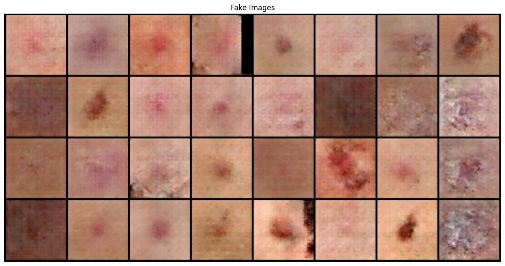

In my Kaggle project, I implemented Generative Adversarial Networks (GANs) for image augmentation to address the challenge of limited data in machine learning tasks. By training a GAN, I created two networks: a generator and a discriminator. The generator produces synthetic images, while the discriminator evaluates them against real images. Through this adversarial process, the generator improves its outputs until the synthetic images resemble real data. The resulting images can be used to augment datasets, enhancing the model's performance by providing more diverse training examples.
You can know more about it here:https://www.kaggle.com/code/parsahriri/gans-for-image-augmentation

