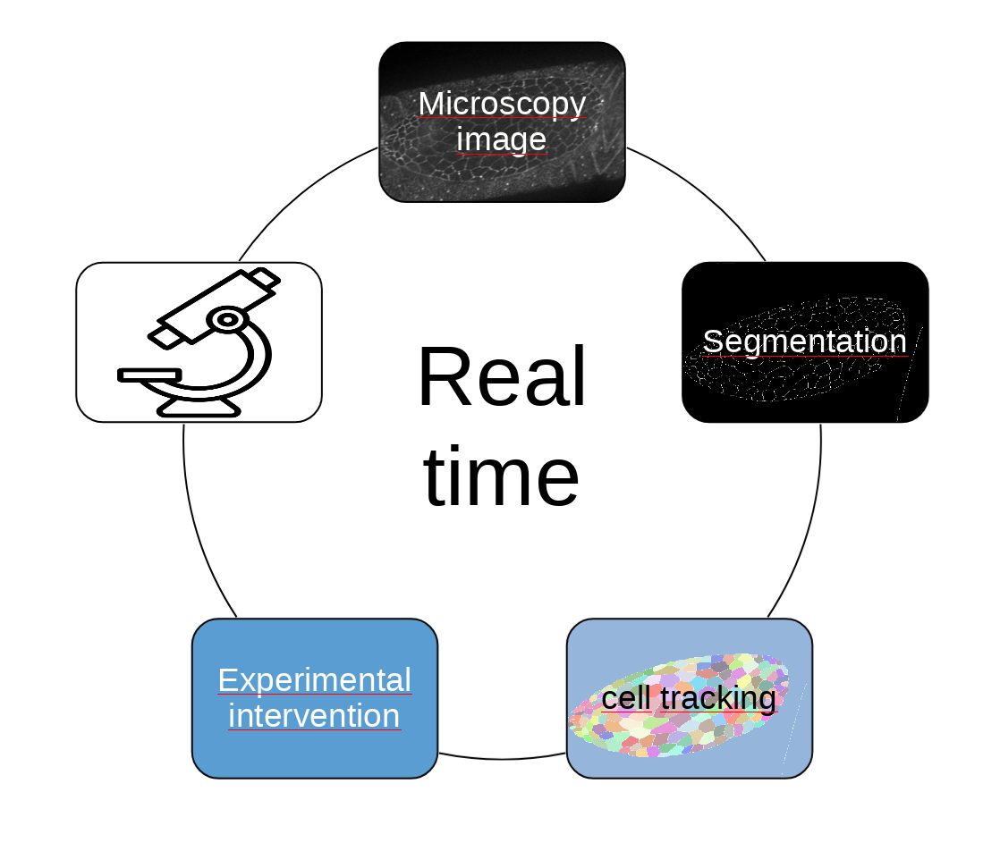

Image segmentation is a fundamental task in computer vision, with applications in medical imaging, autonomous driving, and object recognition. Recent advancements in machine learning have led to the development of powerful models like U-Net, diffusion models, and transformers, which show promise in segmenting images with high precision. 

In this project we tried diffrent models including: convolutional Neural Networks (CNNs)(Unet based), diffusion models, and transformers. And tried to go deeper in diffusion models. And make a user friednly UI for it.

