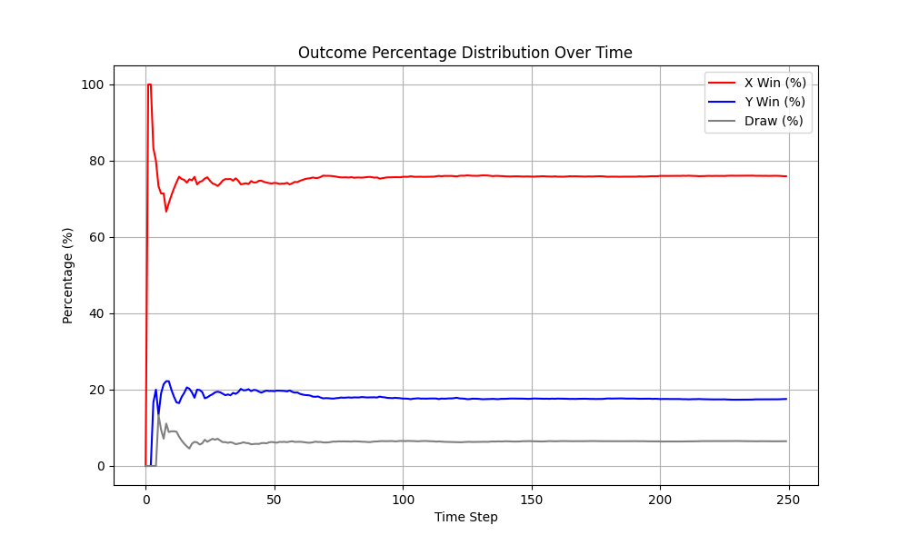

I made a simple tictac game, to try what I am learning in reinforcement learning in a simple c++ env. You can see an eaxmple of the it here smart agent vs random agent:

code avalble: [code](https://github.com/Parsa744/xo_for_RL)
